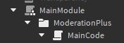

# Plugins: Getting Started

Getting started with developing plugins on Administer is simple.


First off, create a ModuleScript. Name it MainModule, and paste this in:


```lua
-- Example Plugin for Administer

-- darkpixlz, 2023


local AdministerPlugin = {
	OnDownload = function()
		print("The plugin has been installed successfully!")
	end,
	
	Move = function()
		script.PLUGINFOLDER.Parent = game.ServerScriptService:WaitForChild("Administer").Plugins
	end,
	
	Version = 1.0
}

return AdministerPlugin

```

Here's an explanation:\
\
`OnDownload` will fire every time a user installs your plugin, from either the inpanel search, or a Plugin server. You can do anything here, like \[showing a notificaton]\(/), \[a toast]\(/), or anything else.


`Move` is a required function, which moves the plugin's assets to Administer. `Plugin.Build()` will fail if the plugin's script is not in a `Folder` located in the Administer/Plugins folder in ServerScriptService.


Now that that's set up, you can move to getting your plugin ready.


Under that ModuleScript, create a `Folder`. After that, create a normal `Script` inside of the folder. This will be your main plugin script.


Using Moderation+ as our example, you should now have something which looks like this:



After that's done, you can move on to the next step/
